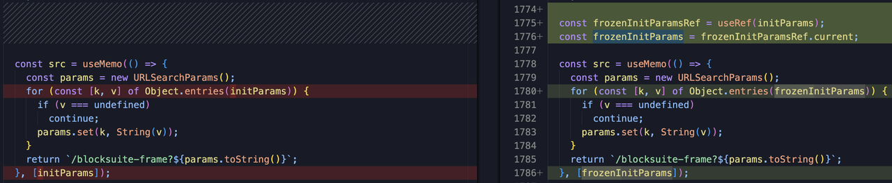
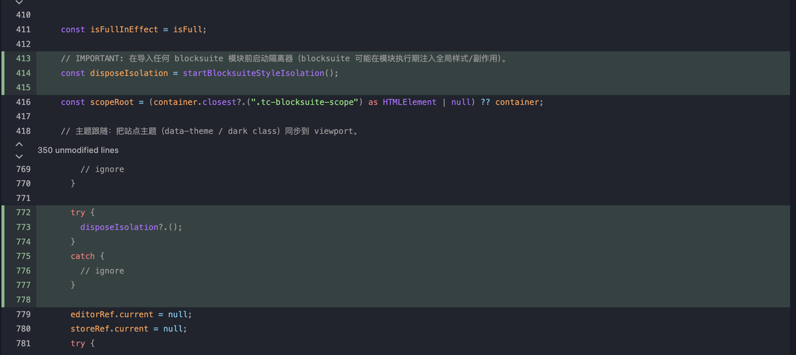
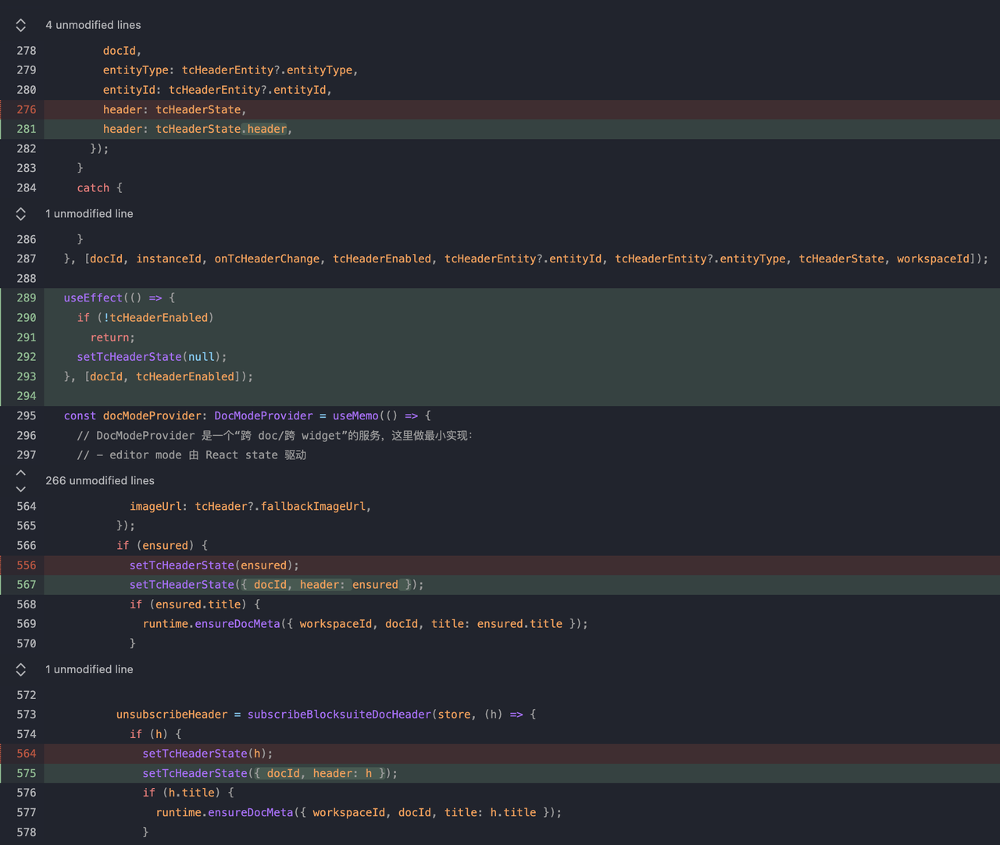
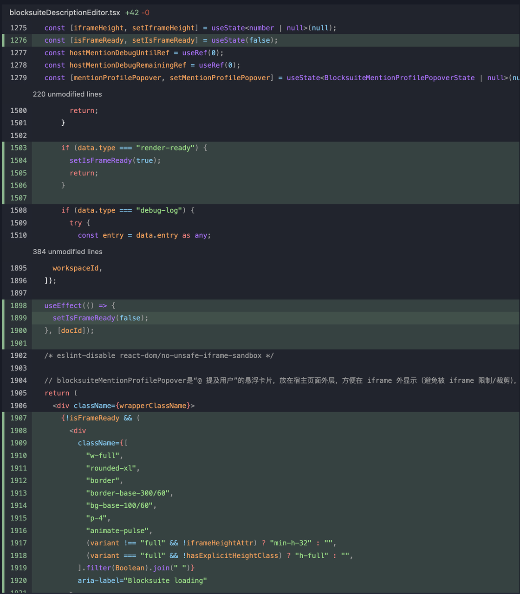
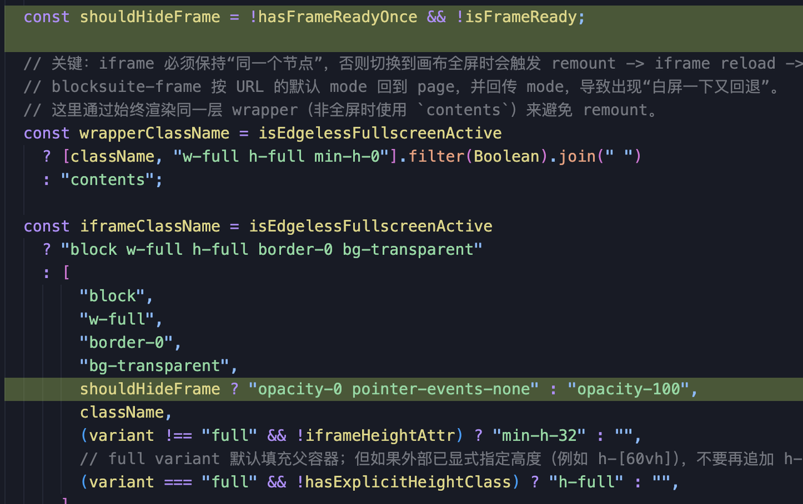
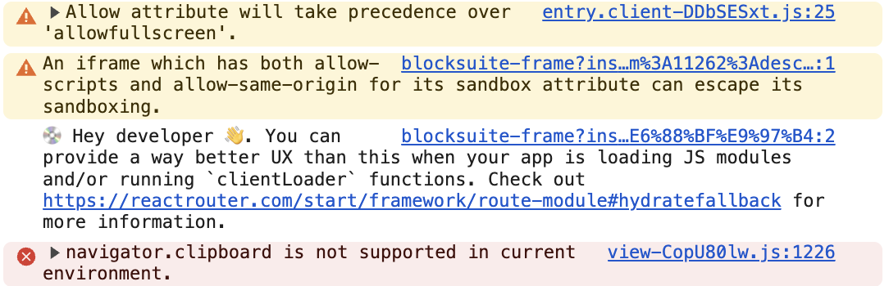

## BlockSuite渲染策略


由于编辑器自带的全局CSS会破坏项目的样式，所以需要使用iframe隔离


iframe可以理解为创建了一个子的浏览器实例，内部会创建一个小的浏览器环境

iframe通过src属性获取内容，这里使用前文提到的路由隔离设置的路由

现代开发中，我们通常会添加以下属性来优化性能和功能。

* 懒加载 (`loading`)，仅当 iframe 接近视口时才加载，极大提升页面初始化速度。

* 功能权限策略 (`allow`)，控制 iframe 是否可以使用摄像头、麦克风、全屏等敏感 API。

* 沙箱隔离 (`sandbox`)，这是 iframe **最强大的安全特性**。加上这个属性后，iframe 中的页面会被视为在一个“低权限”环境中运行。

  * `allow-scripts`: 允许执行 JavaScript。

  * `allow-same-origin`: 允许 iframe 内容被视为同源（否则即使 URL 同源，sandbox 也会强制将其视为跨域，无法读取 Cookie）。

  * `allow-top-navigation`: 允许 iframe 修改父页面的 URL（跳转）。

  * `allow-forms`: 允许提交表单。

```javascript
      <iframe
        ref={iframeRef} // 保存 iframe DOM 引用，用于 postMessage/读取 contentWindow
        src={src} // iframe 内加载的路由（/blocksuite-frame）及其初始化参数
        title="blocksuite-editor" // 无障碍标签，描述 iframe 内容
        className={iframeClassName} // 尺寸/布局/样式控制（含全屏/高度策略）
        allow="clipboard-read; clipboard-write; fullscreen" // 允许剪贴板读写与全屏权限
        allowFullScreen // 允许 iframe 内请求全屏（配合 allow）
        sandbox="allow-scripts allow-same-origin" // 沙盒限制，仅放开脚本执行与同源访问
        height={iframeHeightAttr} // 非全屏嵌入态下由子页面回传的高度
        onLoad={() => { // iframe 加载完成后同步参数/主题/高度
          postFrameParams();
          syncFrameBasics();
        }}
      />
      
```


而项目的prerender策略，会发生hydration，要求服务端执行，

所以不能通过window对象区分是否使用iframe（服务端没有window），那么怎么区分环境？

解决方案是使用路由隔离，设置一个路由渲染的组件是编辑器组件，保证这个组件在iframe内部渲染


渲染编辑器的路径是

外部可访问的编辑器入口组件=>外部设置iframe/已经在iframe内部=>iframe src标记路由，内部渲染编辑器

* 即为编辑器组件设置一个路由，通过路由判断是否使用iframe
* 如果顶层路由是设置的路由，说明一定在iframe内部，那么直接渲染编辑器不会污染
* 否则则在iframe外部，那么先创建iframe，再使用设置的路由，标志src，在iframe内渲染编辑器

* `/blocksuite-frame` 路由：页面里直接渲染真正的 Blocksuite 编辑器（Blocksuite Runtime）。
* 其它路由：这里不直接渲染编辑器，而是渲染一个 iframe，把 /blocksuite-frame 当成子页面塞进去。这样可以把 Blocksuite 的全局样式/副作用隔离起来，避免污染主页面。
* `\<BlocksuiteMentionProfilePopover ... />`：这是“@ 提及用户”的悬浮卡片，放在宿主页面外层，方便在 iframe 外显示（避免被 iframe 限制/裁剪），通过 postMessage 和 iframe 内的编辑器通信。


## 解决白屏闪烁


每次进入文档，都会发生白屏（可能有HTML可能没有）的闪烁，然后再加载样式恢复正常


### iframe reload


定位问题源：editor从白屏到无CSS到有CSS


关键点：

* 以前：src 里带 docId，切文档会 reload iframe → 白屏（下载CSS）

* 现在：src 固定不变（首帧参数冻结），改成 postMessage 同步参数


React 的 useMemo 只在依赖变化时更新，但你的 initParams 依赖里包含 docId 等会频繁变化的字段。

如果直接 useMemo(initParams)，每次 docId 变 → src 变 → iframe reload。

用 useRef 的核心作用是：

* **只在首次 render 时赋值**

* 之后即使 props 变，也不会更新 ref.current
  这就把“首帧参数”冻结住了。




**为什么不直接写常量或 useState**

* 常量拿不到 props

* useState(initParams) 也能冻结，但 useRef 更轻量、不会引发 rerender

* useRef 是最适合“保存首帧值，不参与渲染”的用途


src冻结后如何更新？

* 因为 iframe 的 src 已冻结，不再随着 docId 变化而刷新。

* 所以“文档切换 / 只读 / header / mode”等变更必须通过 postMessage 传进去。

* postFrameParams() 就是专门发这份“运行时参数包”。


**postFrameParams 何时触发**

* useEffect 依赖 docId、mode、tcHeader 等变化 → 每次变动都会发送

* iframe onLoad 时会发一次（确保首屏参数同步）

* iframe 向宿主发送 ready 时，也会再发一次（兜底：确保 iframe 初始化晚于 onLoad 的场景也能同步）


### 为什么不再reload后失去文章样式？


问题定位：除了第一个文章，后续文章都失去样式，显然和组件生命周期和显然是CSS没成功生效的有关，定位Style相关代码


doc 切换时 startBlocksuiteStyleIsolation() 被反复启动/释放，释放会清掉 Blocksuite 模块级注入的样式，但这些样式在模块缓存后不会再次注入，所以后续文档就“没样式”。



事实上，这里没必要再用隔离器了，因为我们保证所有editor都在iframe内部了，删掉相关逻辑即可


### 为什么部分样式依然没生效


之前的行为是所有样式都没用，连居中都没有，现在一看似乎有了居中，但是编辑器一些语法块样式依旧没用


定位问题：显然还是CSS问题，但是本文件里以及没有影响CSS的因素了，那么围绕编辑器的生命周期找其他影响CSS的组件，Runtime之上我们已经了解了，关键在于runtime之下


让ai定位和css/style相关的部分，发现还有一个installGlobalDomStyleGuard功能和startBlocksuiteStyleIsolation()是类似的&#x20;

```sql
BlocksuiteDescriptionEditorRuntime 初始化顺序（含职责）

[Mount]
  |
  |--(sync) startBlocksuiteStyleIsolation()
  |         作用：启动样式隔离，避免 Blocksuite 污染全局
  |
  |--(async effect)
      |
      |--(async) ensureBlocksuiteRuntimeStyles()
      |         作用：注入/改写运行时 CSS，限定作用域
      |
      |--(async) loadBlocksuiteRuntime()
      |         作用：按需加载 blocksuite 运行时模块
      |         |-- createEmbeddedAffineEditor
      |         |-- spec/coreElements（注册自定义元素）
      |         |-- spaceWorkspaceRegistry（workspace/doc 管理）
      |
      |--(async) ensureBlocksuiteCoreElementsDefined()
      |         作用：确保 blocksuite Web Components 可用
      |
      |--(sync) getOrCreateWorkspace()
      |         作用：获取/创建 workspace 容器
      |
      |--(async) restore remote snapshot (descriptionDocRemote)
      |         作用：恢复远端内容，避免空白/重复根块
      |
      |--(sync) ensureDocMeta()
      |         作用：初始化 doc meta（标题等）
      |
      |--(sync) getOrCreateDoc()
      |         作用：获取/创建 doc store
      |
      |--(sync/async) tcHeader init + subscribe
      |         作用：初始化/订阅自定义头部（标题/封面）
      |
      |--(sync) store.load() + resetHistory()
      |         作用：加载 doc，重置历史（对齐 playground 行为）
      |
      |--(async) createEmbeddedAffineEditor(...)
              作用：创建 editor 容器并注入扩展/服务
              |
              |--(sync) installGlobalDomStyleGuard()
              |         作用：记录/回滚 Blocksuite 对全局 DOM 的影响
              |
              |--(sync) installSlashMenuDoesNotClearSelection()
              |         作用：避免 slash menu 点击导致选区丢失
              |
              |--(sync) new LinkedDocViewExtension().effect()
              |         作用：注册 linked-doc 相关组件
              |
              |--(sync) set extensions/services
              |         作用：@/linked-doc 菜单、QuickSearch、DocModeProvider 等
              |
              |--(sync) create tc-affine-editor-container
              |         作用：生成实际 editor DOM 容器
              |
              |--(sync) hook docLinkClicked -> navigate
              |         作用：doc 链接点击跳转路由/切文档
              |
              |--(sync) inject local style fixes
              |         作用：修复本地样式细节（svg/display/line-height）

```


感觉“ViewExtension 全失效”的根因不是 spec，而是全局样式/host 注入被清掉。

上次的 guard 仍会在 doc 切换时把 head/adoptedStyleSheets 复原，导致 widgets/toolbar 等样式失效。

和星爷确认所有编辑器都在iframe内后，决定直接把guard相关代码删去


文章闪烁问题解决，样式恢复正常，startBlocksuiteStyleIsolation() 和installGlobalDomStyleGuard大致都是尝试shadow DOM的隔离手段时的遗留产物


在每次都reload iframe的旧版逻辑下，事实上不存在生命周期，每个文章都是从零开始的首次挂载，也不存在文章切换，这类清理的逻辑问题自然就不会暴露


### 为什么侧边栏出现闪烁了


问题定位：表现为切换文章后，左侧选中的新文章短暂显示上一个文章的状态，标题栏和文章图标都出现，造成侧边栏闪烁，侧边栏的状态源是zustand的store，在editor又有和iframe通信等等复杂的逻辑，不好直接定位

将上述信息简洁地给ai也无法较好的修复（这里试了好久😭）

于是还是得分析这块复杂的逻辑，这里转化了视角，让ai帮忙分析数据流和通信时序相关的信息


Q:

梳理消息通信时序，包括doc切换，doc内header更新，以及与外部同步


A:

下面按“消息通信时序”梳理，聚焦 doc 切换、header 更新、以及与外部同步（host/外部路由/主题/高度等）。引用的实现主要在 [blocksuiteDescriptionEditor.tsx](https://file+.vscode-resource.vscode-cdn.net/Users/chxr/.vscode/extensions/openai.chatgpt-0.4.67-darwin-arm64/webview/#)、[blocksuiteFrame.tsx](https://file+.vscode-resource.vscode-cdn.net/Users/chxr/.vscode/extensions/openai.chatgpt-0.4.67-darwin-arm64/webview/#) 和 [tcMentionElement.client.ts](https://file+.vscode-resource.vscode-cdn.net/Users/chxr/.vscode/extensions/openai.chatgpt-0.4.67-darwin-arm64/webview/#)。

**总体消息通道**

* 统一 postMessage 协议：[`{ tc: "tc-blocksuite-frame", instanceId, type: ... }`](https://file+.vscode-resource.vscode-cdn.net/Users/chxr/.vscode/extensions/openai.chatgpt-0.4.67-darwin-arm64/webview/#)。

* Host 侧监听：BlocksuiteDescriptionEditorIframeHost in [blocksuiteDescriptionEditor.tsx](https://file+.vscode-resource.vscode-cdn.net/Users/chxr/.vscode/extensions/openai.chatgpt-0.4.67-darwin-arm64/webview/#)。

* Frame 侧监听：BlocksuiteFrameRoute in [blocksuiteFrame.tsx](https://file+.vscode-resource.vscode-cdn.net/Users/chxr/.vscode/extensions/openai.chatgpt-0.4.67-darwin-arm64/webview/#)。

1. **Doc 切换时序（不刷新 iframe，走消息同步）**

* Host 生成 iframe URL 只用初始参数（frozenInitParams），后续 doc 变化不改 src，避免 remount/白屏回退。[blocksuiteDescriptionEditor.tsx](https://file+.vscode-resource.vscode-cdn.net/Users/chxr/.vscode/extensions/openai.chatgpt-0.4.67-darwin-arm64/webview/#)

* DocId / workspace / mode 等变更时，Host useEffect 调 postFrameParams() -> 发送 type: "sync-params"。[blocksuiteDescriptionEditor.tsx](https://file+.vscode-resource.vscode-cdn.net/Users/chxr/.vscode/extensions/openai.chatgpt-0.4.67-darwin-arm64/webview/#)

* Frame 收到 sync-params 后更新内部 frameParams（docId、workspaceId、tcHeader 等）。[blocksuiteFrame.tsx](https://file+.vscode-resource.vscode-cdn.net/Users/chxr/.vscode/extensions/openai.chatgpt-0.4.67-darwin-arm64/webview/#)

* BlocksuiteDescriptionEditorRuntime 因 props 变更触发内部初始化/清理：中断旧加载、unsubscribe header、重建 store/editor、恢复远端 snapshot。[blocksuiteDescriptionEditor.tsx](https://file+.vscode-resource.vscode-cdn.net/Users/chxr/.vscode/extensions/openai.chatgpt-0.4.67-darwin-arm64/webview/#)

- **Doc 内 header 更新时序（本地/远端变化 -> Host/外部）**

* Frame 侧 runtime：

  * 初始化时 ensureBlocksuiteDocHeader 写入 fallback；

  * 订阅 subscribeBlocksuiteDocHeader，header 变化会更新 tcHeaderState。[blocksuiteDescriptionEditor.tsx](https://file+.vscode-resource.vscode-cdn.net/Users/chxr/.vscode/extensions/openai.chatgpt-0.4.67-darwin-arm64/webview/#)

* tcHeaderState 变化触发：

  * 同步 blocksuite workspace meta title（linked-doc 搜索依赖）；

  * 如果在 iframe 内：postMessage 发 type: "tc-header"；

  * 同时调用 onTcHeaderChange 回调。[blocksuiteDescriptionEditor.tsx](https://file+.vscode-resource.vscode-cdn.net/Users/chxr/.vscode/extensions/openai.chatgpt-0.4.67-darwin-arm64/webview/#)

* Host 收到 type: "tc-header"：

  * 校验 docId 后写入 useEntityHeaderOverrideStore；

  * 再调用 onTcHeaderChange 通知外部。[blocksuiteDescriptionEditor.tsx](https://file+.vscode-resource.vscode-cdn.net/Users/chxr/.vscode/extensions/openai.chatgpt-0.4.67-darwin-arm64/webview/#)

- **与外部同步（主题/高度/模式/导航/mention/调试）**

* 主题同步（Host -> Frame）

  * Host 监听 data-theme/class 变更并发 type: "theme"。

  * Frame 收到后设置 documentElement.dataset.theme + [classList.dark](https://file+.vscode-resource.vscode-cdn.net/Users/chxr/.vscode/extensions/openai.chatgpt-0.4.67-darwin-arm64/webview/#)，并触发高度测量。
    [blocksuiteDescriptionEditor.tsx](https://file+.vscode-resource.vscode-cdn.net/Users/chxr/.vscode/extensions/openai.chatgpt-0.4.67-darwin-arm64/webview/#) + [blocksuiteFrame.tsx](https://file+.vscode-resource.vscode-cdn.net/Users/chxr/.vscode/extensions/openai.chatgpt-0.4.67-darwin-arm64/webview/#)

* 高度同步（Frame -> Host + Host 触发）

  * Frame 在嵌入态测量内容高度并发 type: "height"；

  * Host 在 onLoad/ready 时发 type: "request-height"；

  * Host 收到 height 后设置 iframe height。
    [blocksuiteFrame.tsx](https://file+.vscode-resource.vscode-cdn.net/Users/chxr/.vscode/extensions/openai.chatgpt-0.4.67-darwin-arm64/webview/#) + [blocksuiteDescriptionEditor.tsx](https://file+.vscode-resource.vscode-cdn.net/Users/chxr/.vscode/extensions/openai.chatgpt-0.4.67-darwin-arm64/webview/#)

* 模式同步（Frame -> Host）

  * Frame 内部 mode 改变时 postMessage type: "mode"；

  * Host 更新 frameMode、触发 onModeChange。
    [blocksuiteFrame.tsx](https://file+.vscode-resource.vscode-cdn.net/Users/chxr/.vscode/extensions/openai.chatgpt-0.4.67-darwin-arm64/webview/#) + [blocksuiteDescriptionEditor.tsx](https://file+.vscode-resource.vscode-cdn.net/Users/chxr/.vscode/extensions/openai.chatgpt-0.4.67-darwin-arm64/webview/#)

* 导航委托（Frame -> Host）

  * runtime onNavigateToDoc 在 iframe 场景发 type: "navigate"；

  * Host 可拦截 onNavigate，否则 navigate()。
    [blocksuiteDescriptionEditor.tsx](https://file+.vscode-resource.vscode-cdn.net/Users/chxr/.vscode/extensions/openai.chatgpt-0.4.67-darwin-arm64/webview/#)

* Mention 交互（Frame -> Host）

  * mention element postMessage mention-hover / mention-click；

  * Host 控制浮层与跳转。
    [tcMentionElement.client.ts](https://file+.vscode-resource.vscode-cdn.net/Users/chxr/.vscode/extensions/openai.chatgpt-0.4.67-darwin-arm64/webview/#) + [blocksuiteDescriptionEditor.tsx](https://file+.vscode-resource.vscode-cdn.net/Users/chxr/.vscode/extensions/openai.chatgpt-0.4.67-darwin-arm64/webview/#)

* Debug 日志（Frame -> Host）

  * Frame 注入 \_\_tcBlocksuiteDebugLog，发送 type: "debug-log"；

  * Host 收到后进行控制台输出与补充日志。
    [blocksuiteFrame.tsx](https://file+.vscode-resource.vscode-cdn.net/Users/chxr/.vscode/extensions/openai.chatgpt-0.4.67-darwin-arm64/webview/#) + [blocksuiteDescriptionEditor.tsx](https://file+.vscode-resource.vscode-cdn.net/Users/chxr/.vscode/extensions/openai.chatgpt-0.4.67-darwin-arm64/webview/#)

**握手/时序补充**

* Frame mount 后会发 type: "ready"；Host 收到后再次推送 sync-params + theme + request-height，保证 iframe 真正 ready 后状态一致。
  [blocksuiteFrame.tsx](https://file+.vscode-resource.vscode-cdn.net/Users/chxr/.vscode/extensions/openai.chatgpt-0.4.67-darwin-arm64/webview/#) + [blocksuiteDescriptionEditor.tsx](https://file+.vscode-resource.vscode-cdn.net/Users/chxr/.vscode/extensions/openai.chatgpt-0.4.67-darwin-arm64/webview/#)


Q:

切换文档时上一个header会短暂占据新的文档的外部状态然后再恢复，出现闪烁，问题出在哪个链路


A:

问题链路在 iframe 内 BlocksuiteDescriptionEditorRuntime 的 tcHeaderState -> postMessage/onTcHeaderChange 这一段，切换 doc 时旧 header 会被带到新 docId 上短暂上报。

具体原因：

* tcHeaderState 是组件级 state，不会在 docId 切换时立刻清空。

* useEffect 依赖里包含 docId 和 tcHeaderState：当 docId 变化时，这个 effect 会立即执行一次，用“旧的 tcHeaderState + 新的 docId” 组合去 postMessage 和 onTcHeaderChange。[blocksuiteDescriptionEditor.tsx](https://file+.vscode-resource.vscode-cdn.net/Users/chxr/.vscode/extensions/openai.chatgpt-0.4.67-darwin-arm64/webview/#)

* 随后新 doc 的 ensureBlocksuiteDocHeader/subscribeBlocksuiteDocHeader 才把 tcHeaderState 更新成正确值，于是又上报一次，导致外部状态先错后对，出现闪烁。

链路简述：

1. Host 发送 sync-params -> Frame 更新 docId。

2. Runtime 先触发 tcHeaderState effect（旧 state + 新 docId） -> 外部被错误覆盖。

3. 新 doc 的 header 初始化/订阅完成 -> tcHeaderState 变新 -> 外部再被修正。

如果要彻底避免闪烁，思路是：doc 切换时先把 tcHeaderState 清空或标记失效，等新 doc header ready 再上报；或在 effect 中校验 header 来源 docId（需要在 store/header 里带 docId 或在 state 中携带 “header 对应的 docId”）。


AI突然就会了，原本我给予清理状态的指示让他修复闪烁他都不能较好的修复，现在我没有指出清理状态和修复闪烁的要求，他就很简洁的分析出了解决方案


这里说明主动思考怎么解决问题，给ai一个解题步骤，能让ai的能力更强，或许就是思维链？思维链是需要是自己想出来的，这是人在解决问题上起的作用

而且他思考的时间比起我模糊的让他修复时，速度有了显著的提升，我认为是减少了无关的上下文的原因，增加了对解决问题有关键帮助的上下文，加上这里是一个新对话，也隔离了之前错误的尝试的无关上下文干扰


改动要点

* tcHeaderState 现在携带 `{ docId, header }`，effect 里校验 `tcHeaderState.docId === docId` 才上报。

* docId 变化时先 setTcHeaderState(null)，避免旧值被复用。

* 订阅/初始化 header 时都写入当前 docId。





### 如何解决首次加载的白屏


现在解决了切换的白屏，但是首次加载还是存在白屏，如何解决？

首先已经知道这个白屏的原因是iframe首次初始化环境造成的，下载css构建cssom必然需要时间，这个过程本身是不可规避的

所以应该尝试通过类似loading的样式进行视觉上的覆盖，或者在loading期间设置背景，总之是做视觉上的处理


首先尝试了在iframe标签上加了内联的style设置背景色避免突兀的白屏，但是事实出现了先出现设置的背景色再白屏，再恢复正常的现象


说明这个style是在iframe准备好之前的占位内容，而iframe准备好了，到里面内容准备好之间才是白屏发生的时间点

iframe内部的组件是什么？就是runtime组件，所以应该分析runtime的本身的时序


白屏的问题发生在文章的初始化，初始化逻辑往往在useEffect内部（因为文章的初始化可以视为docId等等状态变化的副作用），于是就可以让ai根据依赖和上下文定位到一个effect


**这整个 useEffect 的职责**

* 负责在 docId/workspaceId 等变化时**创建并挂载** blocksuite editor（含样式注入、workspace/doc 初始化、header 同步、editor 实例创建），并在 cleanup 时**释放**监听/引用，避免跨文档污染和内存泄漏。

* 同时承担 theme 同步、portal 监听、Undo/Redo 快捷键兜底等“运行时周边配套”。


核心异步函数的流程：

1. ensureBlocksuiteRuntimeStyles()：确保 blocksuite 运行时 CSS 已注入并做过作用域处理。

2. loadBlocksuiteRuntime()：懒加载 runtime（createEmbeddedAffineEditor / core elements / workspace registry）。

3. ensureBlocksuiteCoreElementsDefined()：注册自定义元素。

4. getOrCreateWorkspace()：获取 workspace。

5. 迁移旧 docId（legacy -> 新格式）。

6. getRemoteSnapshot() + restoreDocFromUpdate()：先拉远端快照，避免初始化空白 root。

7. ensureDocMeta() + getOrCreateDoc()：创建/获取 store。

8. ensureBlocksuiteDocHeader() + subscribeBlocksuiteDocHeader()：初始化 header，并订阅变更同步到外部状态。

9. store.load() + resetHistory()：保证 store ready 并清掉历史。

10. createEmbeddedAffineEditor()：创建 editor，并挂载到 DOM（container.replaceChildren）。

11. 设置 editor 只读/尺寸/模式等属性，并注册 Undo/Redo 兜底快捷键。

12. DEV 环境下挂全局引用便于调试。

13. cleanup 时断开监听、清 DOM、清引用。


**render-ready 是怎么确定的**

* 不是“iframe onLoad”或 “ready” 消息，而是 **在 editor 真正插入 DOM 之后的下一帧**。

* 也就是上述的第十步之后，dom挂载发生在createEmbeddedAffineEditor()内部，把style相关内容设置完之后给外部发送render-ready的消息

  


* 这样保证：

  * DOM 已经替换完成；

  * 浏览器至少经历了一帧合成/布局的机会，视觉上已可见；

  * host 收到 render-ready 后才隐藏 skeleton，所以不会在“DOM 未可见但 onLoad 已触发”的空窗期白屏。

* 而宿主组件监听这个消息，设置loading状态就可以了

  


### 为什么其他入口还是存在白屏闪烁


为什么行为不同


ChatPageContextMenu → RoomSettingWindow&#x20;

在 roomSettingWindow.tsx 中渲染 BlocksuiteDescriptionEditor，并带有 className="h-full"。


这使得 BlocksuiteDescriptionEditorIframeHost 将其视为“显式高度”（hasExplicitHeightClass 变为 true），因此加载骨架不会添加 h-full。骨架只是其固有高度，而不是全屏覆盖。


iframe 总是渲染（骨架不是绝对定位）。因此，当骨架在顶部显示时，其余区域会显示下面的 iframe 背景/内容，导致加载时的白色闪烁/部分文档内容。


SidebarTreeOverlay → 在 chatPage.tsx 中打开文档使用 BlocksuiteDescriptionEditor，没有 className。hasExplicitHeightClass 为 false，因此骨架会添加 h-full 并在首次渲染时完全覆盖 iframe。因此没有闪烁，“正常加载”。


这里简单的去掉外部传入的h-full就行，去掉一切闪烁了


现在不同入口使用tcHeader的文档的loading全部正常了，但是个人主页即使用默认blocksuite标题的存在ready时序总是晚一小会儿，加载出下方标题再闪烁到上方


解决方案是在收到ready消息前严格就让其透明




## 仅在生产环境无法粘贴？





这通常只有两种原因（和“生产才出问题”完全吻合）：

**生产不是安全上下文**
navigator.clipboard 只在 **HTTPS 或 localhost** 生效。
开发环境是 http://localhost（被浏览器当作安全上下文），所以能用；
生产如果是 http://，就会直接变成“不支持”。

**生产响应头禁止了剪贴板权限**
如果服务器加了 Permissions-Policy: clipboard-read=(), clipboard-write=()
就算是 HTTPS，也会被禁用。

***

**你现在的 iframe 属性其实没问题**
allow="clipboard-read; clipboard-write; fullscreen" 已经开了。
所以真正的阻断几乎一定在 **“HTTPS 或 Permissions-Policy”** 这一层。

***

你可以这样快速验证

在生产环境打开 /blocksuite-frame?...，控制台执行：

`window.isSecureContext`
`navigator.clipboard`

如果 isSecureContext === false：就是 **HTTP** 导致的。

如果是 true 但 navigator.clipboard 仍然是 undefined：就是 **Permissions-Policy** 禁了。
