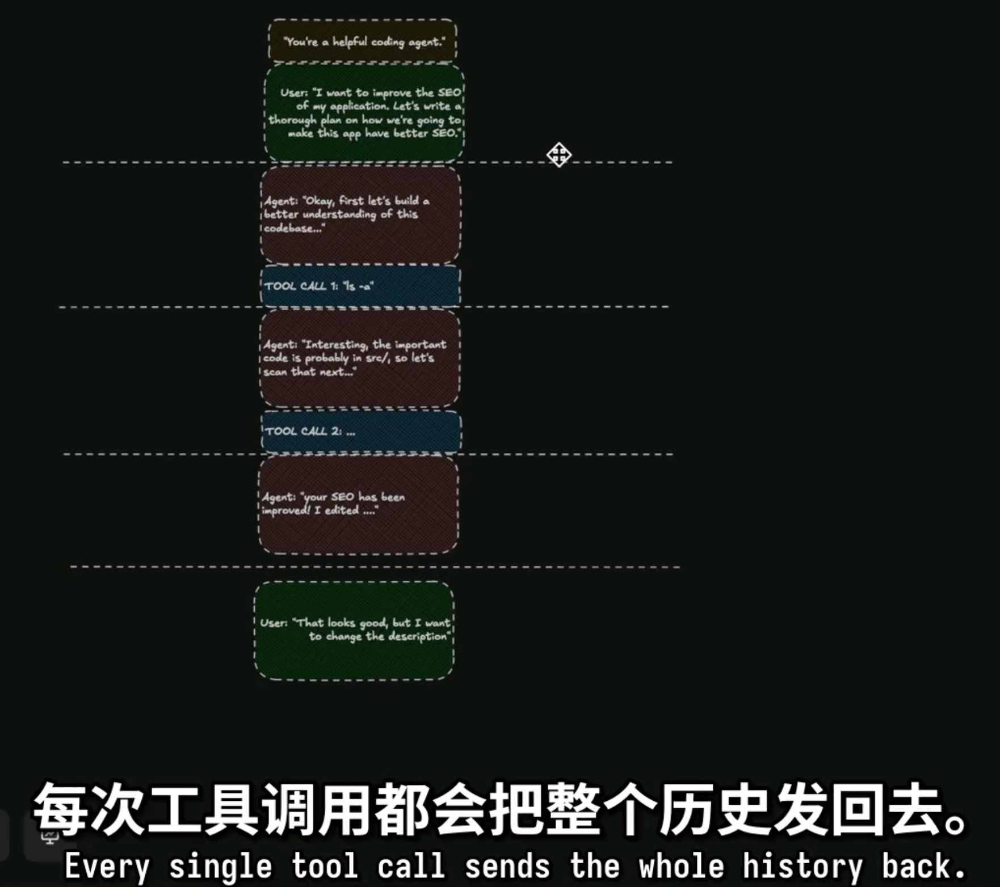
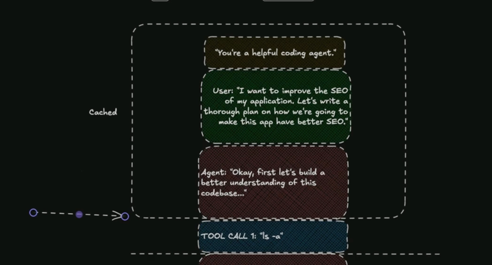

Server-Sent-Events (SSE)  
SSE（**Server-Sent Events**）是一种基于 HTTP 的服务器向客户端**单向推送实时数据**的机制。

SSE 的响应头通常是：

```plain text
Content-Type: text/event-stream
```

数据是**持续不断发送的文本流**，每条消息由若干行组成，格式如下：

```plain text
field: value
field: value
```

**每条消息必须以一个空行结尾（\n\n），field 包括以下内容**

- **`data:`** - The message payload
- **`event:`** - Event type for named events
- **`id:`** - Message ID for resumption
- **`retry:`** - Reconnection time in milliseconds
- **`:`** - Comments (often used for keepalive)

连接生命周期：SSE 从建立连接 → 数据推送 → 断线 → 自动重连 → 续传

```javascript
Client                           Server
  |                                |
  |-------- GET /events ---------> |
  | (Includes Last-Event-ID if     |
  |  reconnecting)                 |
  |                                |
  |<-- HTTP 200 text/event-stream -|
  |                                |
  |                                |
  |<---- data: message 1\n\n ------|
  |                                |
  |<---- data: message 2\n\n ------|
  |                                |
  |<------ : keepalive\n\n ------- |
  |                                |
  |\                              /|
  | \\  Connection drops          / |
  |  \\                          /  |
  |                                |
  |-- GET /events (Last-Event-ID) >|
  | (Automatic reconnection)       |
  |                                |
  |<--- Resume from message 3 -----|
  |                                |
```

SSE 本质还是无状态的 HTTP，但表现得像流，通过 `id + Last-Event-ID` 实现断线续传。  
服务器根据：`Last-Event-ID: 42` 决定：从 **message 3（或之后）继续发送**

例如：

```plain text
id: 43
data: message 3

id: 44
data: message 4
```

客户端只是订阅者：不发消息，只接收。

客户端如何使用 SSE：  
`EventSource` 是浏览器提供的一个 **用于接收服务器实时推送数据的 API**，基于 **Server-Sent Events（SSE）** 技术。  
简而言之，是在浏览器的一个 Web API，会在和服务器建立连接时监听相应事件。

```javascript
const eventSource = new EventSource('/events'); // 一个特殊对象

// 连接成功时打印
eventSource.onopen = (event) => {
  console.log('Connection opened');
};

// 接收消息
// 服务器发送格式类似：data: hello world
// 浏览器收到后触发 onmessage
eventSource.onmessage = (event) => {
  console.log('Received:', event.data);
};

// 断线后 浏览器会自动重连
// 不需要你手动写重试逻辑
eventSource.onerror = (event) => {
  if (event.target.readyState === EventSource.CLOSED) {
    console.log('Connection closed');
  } else {
    console.log('Connection error, will retry');
  }
};

// 监听自定义事件
// 服务器发送以下格式文本时，浏览器会触发该函数
// event: user-login
// data: {"name":"Alice"}
eventSource.addEventListener('user-login', (event) => {
  console.log('User logged in:', event.data);
});
```

---

WebSocket 是一种**浏览器和服务器之间的“长实时连接通信协议”**。  
而 SSE 是 HTTP 的一种通信方式。

<table header-row="true">
<tr>
<td>特性</td>
<td>HTTP</td>
<td>WebSocket</td>
</tr>
<tr>
<td>连接方式</td>
<td>请求-响应（一次性）</td>
<td>持久连接</td>
</tr>
<tr>
<td>通信方向</td>
<td>客户端 → 服务器</td>
<td>双向（随时互发）</td>
</tr>
</table>

WebSockets 通过 HTTP 升级握手创建了一个全双工通信通道。

```javascript
const ws = new WebSocket('wss://example.com/socket');

ws.onopen = (event) => {
  console.log('Connected');
  ws.send('Hello Server');
};

ws.onmessage = (event) => {
  console.log('Received:', event.data);
};

ws.onerror = (error) => {
  console.error('Error:', error);
};

ws.onclose = (event) => {
  console.log('Disconnected:', event.code, event.reason);
  // Manual reconnection needed
};

// Send various data types
ws.send('Text message');
ws.send(JSON.stringify({ type: 'json' }));
ws.send(new Blob(['binary data']));
ws.send(new ArrayBuffer(8));
```

WebSocket 一开始其实是通过 HTTP 发起的：

```plain text
GET /socket HTTP/1.1
Upgrade: websocket
Connection: Upgrade
```

服务器同意后返回：`HTTP/1.1 101 Switching Protocols`  
这一步叫 **握手（Handshake）**，之后就不再是 HTTP，而是 WebSocket 协议。

握手成功后：

- 连接不会断
- 客户端和服务器可以随时发消息
- 不需要每次重新请求

WebSocket 不是用 HTTP body，而是用 **帧（frame）**：

- `text`（文本）
- `binary`（二进制）
- `ping/pong`（心跳）
- `close`（关闭）

客户端：如何使用 WebSocket

```javascript
// 创建 WebSocket 连接
// 使用 wss:// 表示加密连接（类似 https）
const ws = new WebSocket('wss://example.com/socket');

// 连接成功时触发
ws.onopen = (event) => {
  console.log('Connected');

  // 向服务器发送消息（字符串）
  ws.send('Hello Server');
};

// 收到服务器消息时触发
ws.onmessage = (event) => {
  // event.data 就是服务器发来的内容
  console.log('Received:', event.data);
};

// 发生错误时触发
ws.onerror = (error) => {
  console.error('Error:', error);
};

// 连接关闭时触发
ws.onclose = (event) => {
  // event.code：关闭码
  // event.reason：关闭原因
  console.log('Disconnected:', event.code, event.reason);

  // 注意：WebSocket 不会自动重连
  // 如果需要重连，需要手动写逻辑
};

// 发送文本
ws.send('Text message');

// 发送 JSON（需要先转成字符串）
ws.send(JSON.stringify({ type: 'json' }));

// 发送二进制数据（Blob）
ws.send(new Blob(['binary data']));

// 发送 ArrayBuffer（二进制）
ws.send(new ArrayBuffer(8));
```

---

核心区别

1. Communication Direction  
SSE：单向（服务器 → 客户端）

```javascript
// SSE：客户端只能接收数据
eventSource.onmessage = (event) => {
  updateUI(event.data);
};

// 如果要发送数据，需要使用单独的 HTTP 请求
async function sendToServer(data) {
  await fetch('/api/action', {
    method: 'POST',
    body: JSON.stringify(data),
  });
}
```

WebSocket：双向通信

```javascript
// WebSocket：在同一个连接中既可以发送也可以接收
ws.onmessage = (event) => {
  updateUI(event.data);
};

ws.send(
  JSON.stringify({
    action: 'user-input',
    data: 'Hello',
  })
);
```

2. 自动重连机制  
SSE：内置自动重连和断点续传

```javascript
// 不需要额外代码！EventSource 会自动处理重连
const eventSource = new EventSource('/events');

// 服务端可以设置重连间隔
// retry: 5000
```

WebSocket：需要手动实现重连

```javascript
class ReconnectingWebSocket {
  constructor(url) {
    this.url = url;
    this.reconnectDelay = 1000;
    this.shouldReconnect = true;
    this.connect();
  }

  connect() {
    this.ws = new WebSocket(this.url);

    this.ws.onclose = () => {
      if (this.shouldReconnect) {
        setTimeout(() => {
          this.reconnectDelay *= 2; // 指数退避
          this.connect();
        }, this.reconnectDelay);
      }
    };

    this.ws.onopen = () => {
      this.reconnectDelay = 1000; // 重置延迟
    };
  }
}
```

3. 数据类型  
SSE：只支持文本（UTF-8）

```javascript
// SSE：必须把二进制数据序列化
eventSource.onmessage = (event) => {
  // event.data 永远是字符串
  const text = event.data;

  // 如果是二进制，需要用 base64 解码
  const binary = atob(event.data);
};
```

WebSocket：支持文本和二进制

```javascript
// WebSocket：原生支持二进制
ws.binaryType = 'arraybuffer'; // 或 'blob'

ws.onmessage = (event) => {
  if (event.data instanceof ArrayBuffer) {
    // 二进制数据
    const view = new DataView(event.data);
    processBytes(view);
  } else {
    // 文本数据
    const text = event.data;
  }
};

// 可以直接发送二进制
const buffer = new ArrayBuffer(1024);
ws.send(buffer);
```

4. 消息边界与分帧  
SSE：内置消息分隔

```javascript
// 每个 event 都是一个完整消息
eventSource.onmessage = (event) => {
  // event.data 就是一条完整消息
  // 不需要处理粘包或拆包
};
```

WebSocket：保证消息完整，但不定义结构

```javascript
// WebSocket 只保证消息边界，不负责业务结构
ws.onmessage = (event) => {
  try {
    const message = JSON.parse(event.data);

    // 根据消息类型处理
    switch (message.type) {
      case 'chat':
        handleChat(message);
        break;
      case 'status':
        handleStatus(message);
        break;
    }
  } catch (e) {
    console.error('消息格式不合法');
  }
};
```

5. HTTP/2 优势  
SSE：完全支持 HTTP/2 多路复用

```javascript
// SSE 在 HTTP/2 下：多个流复用一个连接
const events1 = new EventSource('/events/stream1');
const events2 = new EventSource('/events/stream2');
const events3 = new EventSource('/events/stream3');
// 都共享同一个 HTTP/2 连接
```

WebSocket：无法利用 HTTP/2 多路复用

```javascript
// 每个 WebSocket 都需要独立的 TCP 连接
const ws1 = new WebSocket('wss://example.com/socket1');
const ws2 = new WebSocket('wss://example.com/socket2');
// 实际上是两个独立的 TCP 连接
```

---

**AI 和 LLM 流式处理：WebSocket 的优势**

1. 双向性  
当由 LLM 驱动的聊天机器人首次出现时，SSE 是服务器向客户端流式传输 token 的自然选择，它简单且擅长服务器推送。  
然而，随着 AI 应用从基础聊天成熟到代理工作流程、人工参与式审批和多设备交互，团队越来越多地采用 WebSocket。核心问题是双向性：现代 AI 交互需要在会话期间让客户端向服务器发送信号（取消生成、批准工具调用、引导代理），而 SSE 无法在同一个连接上提供这种功能。  
同时，一个名为 [持久会话层（durable session）](https://durablesessions.ai/) 的新兴基础设施类别正在 WebSocket 之上构建持久、可恢复的会话层，以应对复杂 AI 工作流程的需求。

2. 有状态  
每次发问和工具调用都会发送完整的历史，因为 LLM 本身没有上下文，它只能单问单答，所以每次问答后，需要发送完整的上下文，以保证下次对话是有记忆的，这不是一次 API 调用，而是一个整理上下文、调用 API 的循环。



然后任何可用的 GPU 会接收所有上下文，然后为了响应而加载它们。  
缓存是为了减少模型需要的计算量，使它更便宜，也能更快地响应，但这不改变发送的数据量，因为缓存的 key 是历史的哈希。  
依然需要发送完整的历史，只不过 GPU side 的加载可以缓存加速，减少的是处理数据的时间。



**问题：** 虽然 GPU 不用重新计算了，但你（客户端）**依然需要通过网络把那几万字的完整历史记录发给 API**。

- **现状：** OpenAI 有成千上万个 GPU（服务器）。
- **随机性：** 你的第 1 次请求可能是 **GPU-1** 处理的，缓存存在 **GPU-1** 上。你的第 2 次请求如果被分配到了 **GPU-5**，而 **GPU-5** 上没有缓存，它得重新计算。
- **系统复杂性：** 为了让缓存生效，OpenAI 的调度系统必须极其聪明，必须强行把你的请求每次都路由回同一台机器（GPU-1）。这对一个每秒处理亿级请求的全球系统来说，压力巨大且很难保证。

WebSocket 解决了什么：

- **有状态连接（Stateful）：** WebSockets 和一个服务器的 GPU 始终保持连接。
- **结果：**
  1. 你不用再通过网络发送几万字的历史记录（解决了痛点 A）。
  2. 因为连接一直连着同一台服务器，肯定能利用到那台机器上的记忆（解决了痛点 B）。

这使得每次仅仅发送增量消息可行了，Context 的信息一直就留在对应的 GPU 上，无状态的 HTTP 是不能做到这一点的。
