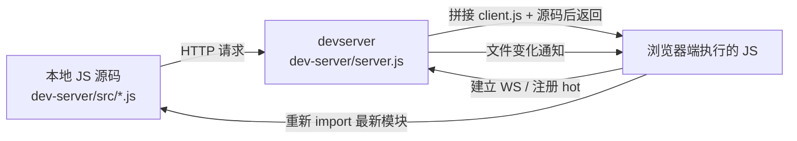

> 上级：[[Vite]]

HMR，也就是 Hot Module Replacement，也就是 **文件一改，Vite 不整页重载，而是沿着模块图只更新受影响的那一小段模块链。**

- 一个优秀的前端工具链应该让 HMR（Hot Module Replacement，热模块替换）变得“零成本”。
- 用户不需要执行任何额外操作，只要保存文件，就能立即看到更新效果。

## hmr 最简实现

原理很简单：

- **Server：文件变了就“广播通知”**
- **Client：收到通知后“自己决定怎么更新页面**

Server（服务器）端，是只开发服务器所在的位置，这里就是你的前端代码在的地方：

- Express 静态资源服务器
- HMR 中间件
    - 这部分就是“开发服务器（Dev Server）”。
    - 拦截 `.js` 文件请求，并注入 HMR 客户端代码（HMR Client）。

Client（客户端），也就是浏览器，是前端代码的请求目标：

- `HotModule` 类的实现
- `hmrClient` 函数，用于初始化 HMR，并连接到 WebSocket。
- 注册（`register`）`accept` 回调函数
    - 用来定义当模块被保存或发生变化时应该执行什么操作。
    - 也就是说，针对特定模块类型，如何进行 HMR 更新。
- WebSocket 客户端（`connectWs`），用于响应来自 Dev Server 的事件通知。

Dev Server（开发服务器），就是上述两者的结合加上前端源码

- WebSocket 服务器
- 文件监听器（File Watcher）
- 当文件发生变化时，通知 HMR 客户端
- 触发模块重新加载（Reload Module）

如果用一句话概括整个流程：

**开发服务器监听文件变化 → 通过 WebSocket 通知浏览器 → 浏览器中的 HMR 客户端接收消息 → 重新加载对应模块并执行已注册的 `accept` 回调 → 页面无需刷新即可更新内容。**


1. 浏览器请求dev server，拿到 index.html，作为入口，依次执行所有的 js模块，会hmrMiddleware 拦截 .js 请求，这个过程会把 hmrClient(import.meta) 进行注入
2. 浏览器和 dev server 建立 websocket 连接
3. 为每个模块创建 HotModule，存入 window.hotModules[path]
4. dev server 监听本地所有 js文件，一旦 js文件更新，就像浏览器发这个更新的文件内容
5. 浏览器 websocket 收到消息，就执行更新

```jsx
// server.js 

import ...

const app = express();
const server = http.createServer(app);
const ws = new WebSocketServer({
  server,
});

/** @type {WebSocket} */
let socket;

ws.on("connection", (_socket) => {
  console.log("Connected...");
  socket = _socket;
});

const watcher = chokidar.watch("src/*.js");

watcher.on("change", (file) => {
  console.log(file);
  const payload = JSON.stringify({
    type: "file:changed",
    file: `/${file}`,
  });
  socket.send(payload);
});

const hmrMiddleware = async (req, res, next) => {

  if (!req.url.endsWith(".js")) {
    return next();
  }

  let client = await fs.readFile(path.join(process.cwd(), "client.js"), "utf8");
  let content = await fs.readFile(path.join(process.cwd(), req.url), "utf8");

  content = `
  ${client}

  hmrClient(import.meta)

  ${content}
  `;

  res.type(".js");
  res.send(content);
};

app.use(hmrMiddleware);
app.use(hmrMiddleware);
app.use(express.static(process.cwd()));

server.listen(8080, () => console.log("Listening on port 8080"));
```

- 这里的逻辑很简单，就是把 client js文件 + hmrClient的函数调用，注入到当前的 js文件之前
- 就是相当于所有 js文件内容，都加一段前置代码

```jsx
// client.js

class HotModule {
  
  file;  // 模块对应的路径，例如 '/src/child.js'
  cb;  // 用户通过 accept 注册的回调函数 (newModule) => void

  // @param {string} file - 模块在服务器上的路径
  constructor(file) {
    this.file = file;
  }

  // 注册 HMR 接受回调。当模块更新并成功重新导入后，会调用此回调并传入新模块对象。
  accept(cb) {
    this.cb = cb;
  }

  // 处理来自服务器的更新通知：如果注册了回调，则带时间戳重新 import 模块并执行回调。
  // 使用查询参数 `?t=` 防止浏览器缓存，保证拿到最新代码。
  handleAccept() {
    if (!this.cb) {
      return;
    }

    import(`${this.file}?t=${Date.now()}`).then((newMod) => {
      this.cb(newMod);
    });
  }
}

function hmrClient(mod) {
  const url = new URL(mod.url);
  const hot = new HotModule(url.pathname);
  import.meta.hot = hot;
  window.hotModules.set(url.pathname, hot);
}

/** @type {Map<string, HotModule>} */
window.hotModules ??= new Map();

window.ws;

if (!window.ws) {
  const ws = new window.WebSocket("ws://localhost:8080");

  ws.addEventListener("message", (msg) => {
    const data = JSON.parse(msg.data);
    const mod = window.hotModules.get(data.file);
    console.log(data.file);
    mod.handleAccept();
  });

  window.ws = ws;
}
```

- HotModule实例：对应一个具体的文件（模块），允许持有一个针对这个文件的处理回调函数，而这个回调函数基本作用就是更新文件内容
- hmrClient()：接收一个模块，将 hmr 实例注入到浏览器的根对象下的 hotModules Map之下
- import.meta.hot 的作用，是把“当前这个模块”的 HMR 挂到模块元信息上，作为热更新的入口 ，**只有使用了import.meta.hot的模块文件 ，才是 hmr的作用对象**
- 启动一个 websocket连接，监听 dev server 的消息，接收到模块，就更新模块

## dev server

这就是简化的 HMR 工作原理，而这整个体系就是 dev server

链路上主要有三个对象，本地 js代码，dev server，browser，三者各干各的事，但通过“请求文件”和“HMR 消息”连起来。



**三者分别是什么**

- 本地 JS 代码：你写在 dev-server/src/app.js 和 dev-server/src/child.js 里的源码，是“原材料”。
- devserver：就是 dev-server/server.js 这个服务端程序，负责接收浏览器请求、读文件、拼接 HMR 客户端、监听文件变化、发 WS 消息。
- 浏览器端 JS 代码：是服务器最终返回给浏览器执行的那份脚本，不只是源码本身，而是 `client.js + 你的源码` 拼出来的结果。

**一次页面加载时怎么交互**

1. 浏览器请求某个 `.js` 文件。
2. server.js 先读 dev-server/client.js，再读对应的源码文件。
3. 服务器把两段内容拼起来返回给浏览器。
4. 浏览器执行这份代码时，先跑 client.js 里的 HMR 逻辑，再跑你的业务代码。
5. client.js 会创建 `HotModule`、建立 WebSocket、把 `import.meta.hot` 注入给当前模块。
6. 你的业务代码里如果写了 `if (import.meta.hot) { import.meta.hot.accept(...) }`，就会注册热更新回调。

**文件改了以后怎么交互**

1. 你改了本地 JS 源码。
2. server.js 用 `chokidar` 监听到本地文件变更。
3. 服务器通过 WebSocket 给浏览器发“哪个文件变了”。
4. 浏览器端的 client.js 收到消息后，找到对应的 `HotModule`。
5. `HotModule.handleAccept()` 再次 `import()` 这个文件的最新版本。
6. 新模块加载完后，执行你在 `accept()` 里注册的回调。
7. 回调里通常会替换 DOM，于是页面局部更新，不整页刷新。

所以 Dev server 职责就是

- 提供 HTTP 服务：浏览器访问时，把页面和 JS 文件发出去。
- 注入 HMR 客户端：在每个 JS 响应里加上客户端逻辑，让浏览器知道怎么监听更新。
- 监听文件变化并通知浏览器：文件改了以后，通过 WebSocket 告诉浏览器哪个模块变了，再由浏览器重新加载这个模块并局部替换。

## Vite 里是怎么样的

实际情况里，很多 accept 逻辑是插件帮你自动生成的。但这个纯 JS demo 里，没有插件帮忙，所以要显式写 import.meta.hot.accept(...)。才能使热更新生效，但实际上，所有的模块都是可以检测到的，只是处理逻辑的问题

- server.js 相当于 Vite 的 dev server 主体。
- client.js 相当于 Vite 注入到浏览器里的 HMR runtime。
- HotModule 相当于 Vite 里管理模块更新的那层运行时对象。
- import.meta.hot.accept(...) 就相当于模块声明“我能自己处理更新”。
