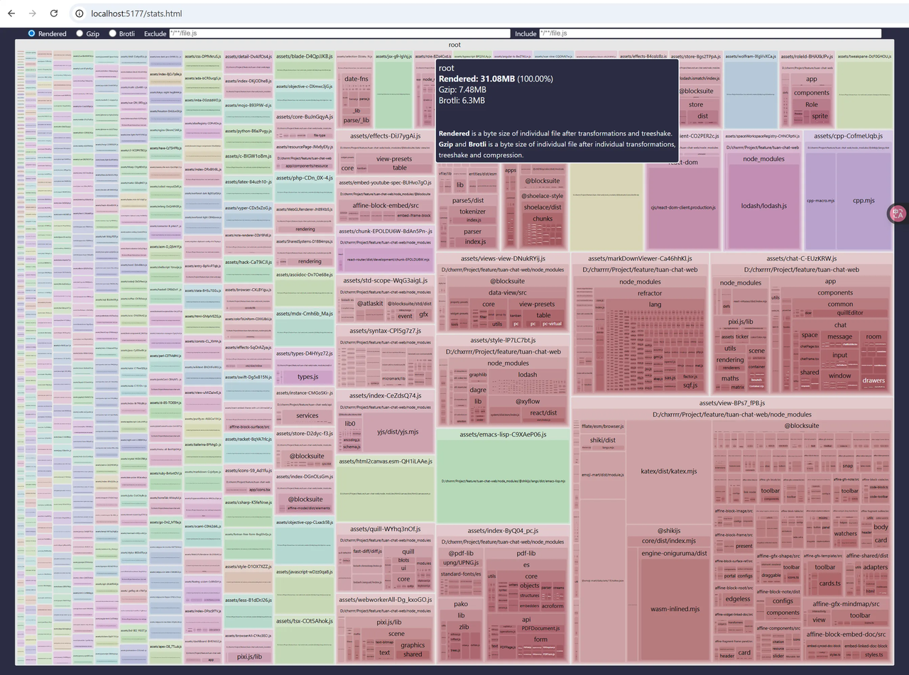
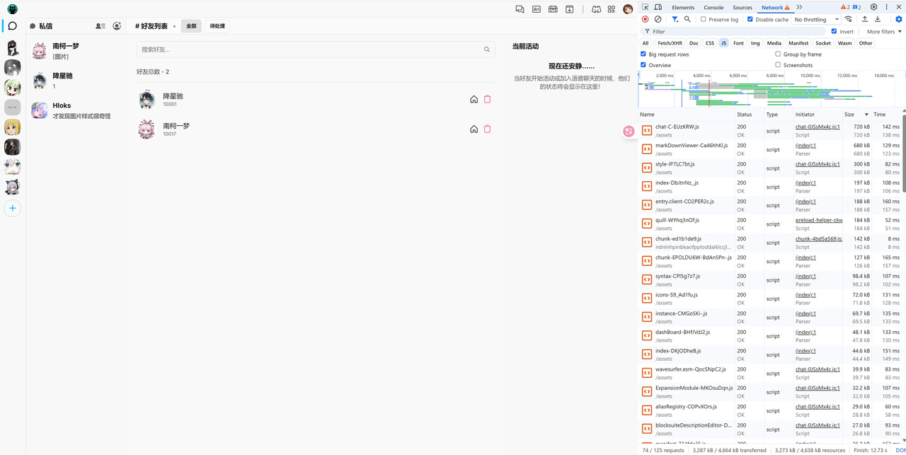

参考和更多细节：

包部分：

- https://www.developerway.com/posts/bundle-size-investigation
- 以及文章作者的书：https://oceanofpdf.com/category/authors/nadia-makarevich/
## 从包体积角度性能优化

首先更系统的了解一下浏览器的流程

**Network → Parse → Build → Layout/Paint → Execute & Interact**

这条链路是顺序依赖的，中间任何一步变慢，后面的都会被拖住。

```
HTML 下载
  ↓
HTML Parse ──┬─> 遇到 CSS → 下载 → 构建 CSSOM
             └─> 遇到 JS  → 下载 → 解析 → 执行（阻塞）
  ↓
DOM + CSSOM → Render Tree
  ↓
Layout → Paint → Composite
  ↓
页面可见（FCP / LCP）
  ↓
JS 继续执行
  ↓
页面可交互（TTI / INP）

```

前文提到的都是js执行内部的优化，这里包体积则侧重于缩减js下载的网络时间

## 工具使用与前提

### 打包器的职责

首先js包是指一个chunk，若干js代码文件压缩后的集合

后文中会提及两类chunk

- **一类 chunk**：应用启动必须的代码（index）
- **另一类 chunk**：第三方库，更新频率低、体积大（vendor）

Vite的打包器（rollup）的默认行为

可以把 Rollup 的默认行为概括为一句话：

> Rollup 会尝试“尽量少生成 chunk，同时避免明显的重复代码”。
> 
- **减少请求（少生成 Chunk）：** 浏览器发起 HTTP 请求是有开销的（尤其是建立连接的时间）。如果一个页面要下载 100 个 1KB 的小文件，速度远慢于下载 1 个 100KB 的大文件。所以 Rollup **倾向于合包**。
- **避免重复（去重）：** 如果组件 A 和组件 B 都引用了 lodash，把 lodash 分别打包进 A 和 B 会导致重复下载。所以 Rollup **倾向于把共享代码提取出来**。
- **首屏纯净（按需）：** 我只访问首页，你不能把后台管理页的代码也发给我。所以 Rollup **倾向于把动态导入（lazy）的部分拆出去**。

**这三点是互相冲突的。** 比如，为了“去重”，必然会增加“Chunk 数量”；为了“减少请求”，必然会牺牲“首屏纯净度”。

- **启发式算法（Heuristic）：** Rollup 会分析你的整个**依赖图（Dependency Graph）**。它会观察：
    - 这个模块被多少个地方引用了？
    - 它是被静态导入（import）还是动态导入（import()）的？
    - 如果我把它拆出来，会不会导致这个页面多出 10 个请求？
    - 如果我不拆出来，这个包会膨胀多少？

**Rollup 的逻辑是：** 它没有绝对的对错，它在寻找一个它认为的“最优解”。如果你不手动干预（manualChunks），它会根据依赖关系的复杂程度，自动决定是“合”还是“拆”。

### 如何观测

> Bundle 的分析，必须基于“生产构建产物”，而不是开发模式。 因为 dev 和 build 的产物，在“体积、结构、执行方式”上几乎是两套系统。
> 

我们最终在意的是生产环境下的性能，所以当然应该build后分析

由于项目使用的是 Vite，使用 [“Rollup Plugin Visualizer”](https://github.com/btd/rollup-plugin-visualizer) 库来分析

如果你使用的是其他工具，只需在谷歌上搜索”你的打包器名称 + 包分析器”——有很多这样的工具可供选择。安装依赖，在vite中完成相关配置

在本地build然后start项目，进入stat.html页面，即可看到报告



- **Rendered**
    - 打包后所有 JS 模块的原始体积之和（开发视角）
- **Gzip / Brotli**
    - 浏览器真实下载成本的近似上限（生产视角）

点击也可以进入具体的包进行分析

### 如何确认首屏js包

build，start的环境下进入首屏，打开dev tool，进入network，勾选JS，disable cache，F5刷新

可以看下图的右下角有传递包的总体积3287kb

```
对比一个工程上常用的经验线：
- **≤ 2 MB**：很健康
- **2–3 MB**：可接受但紧张
- **> 3 MB**：明确有优化空间
```



## 懒加载与预加载优化

要做到包的懒加载，意味着需要进行以下四件事

1. 将代码的一部分标记为“初始加载时不需要”。
2. 将标记的代码提取到自己的代码块中 。
3. 控制下载的确切开始时间。
4. 控制下载进行时的行为。

如何具体实现所有这些功能，答案略有依赖于你使用的框架和打包工具。

在某些情况下，你只需要使用框架的“懒加载/动态导入”版本即可。有时，React的默认“懒加载”导入就能工作。有时，你需要将其与打包工具的配置更改结合起来。有时，你需要安装一个插件或库才能使其生效。

### 包的懒加载

```jsx
// “import { MessageEditor } from '@fe/patterns/message-editor';”

import { lazy } from 'react';
// lazy import for a named componentconst
const MessageEditorLazy = lazy(
   async () => {
       return {
           default: (await import('@fe/patterns/message-editor')).MessageEditor,
       };
});
```

lazy会使得相关的js包，只在被挂载时被下载，而不是最初一并下载，在没有设置manual chunk的情况下，也会把包拆成单独的

懒加载组件行为的验证：

- 如果组件在 `clickedMessage ? <LazyComponent /> : null` 中，初始加载时网络请求中不会出现该组件的代码。
- 只有当你点击消息、状态变为 true、组件挂载时，网络面板才会出现 editor-vendor 等文件的下载记录。

如果把懒加载组件从“条件渲染”改为“直接渲染”

- **现象**：
    1. 浏览器先并行下载核心代码（index 和 vendor）。
    2. 浏览器执行这些代码，发现里面有个懒加载组件需要挂载。
    3. **此时才开始**下载懒加载的 Chunk。
- **后果（瀑布流 Waterfall）**：原本可以并行下载的所有 JS，现在变成了**串行（按顺序）下载**。浏览器在等待懒加载代码下载期间，屏幕可能是一片空白或卡顿。
- **教训**：不要为了懒加载而懒加载。如果你在页面初始渲染时就需要这个组件，那么将其设为“懒加载”只会导致下载顺序由“并行”变“串行”，从而拖慢速度。
- 为了解决“代码下载期间浏览器在干等”的问题，我们需要引入 React 的 Suspense。它允许我们在代码下载时展示一个占位符（Loading 状态），从而改善用户体验。
- 这里的suspense针对的不是数据有没有fetch，而是针对一个组件的包有没有下载完

**正确使用 Lazy + Suspense**：

- **核心逻辑**：React 渲染“关键路径”（如消息列表），**不等待**懒加载的编辑器代码。
- **结果**：消息列表先显示，页面立即变得可交互。

```jsx
import { lazy, Suspense } from 'react';

const MessageEditorLazy = lazy(() => import('./MessageEditor'));

// 在组件中
<Suspense fallback={<Spinner />}>
  <MessageEditorLazy />
</Suspense>
```

### 手动拆分包

**为什么拆分chunk是必要的：减少不必要的下载负担**

一些共享组件被多个页面用到，但不在同一个访问会话里

结果：

- 被抽成 shared chunk
- 所有页面都要为它们付出下载成本

在第二步，我们需要将“lazy”组件提取成独立的块，以减轻我们的供应商的负担。这一步将严重依赖于你使用的打包器或框架。有时，你不需要做任何事情。拆分将自动发生。

经过测试，vite是会自动拆分lazy包的，但是手动分chunk在一些场景下依然是必要的

**为什么手动拆分chunk依然是必要的：避免包结构不稳定性**

随着代码演进：

- 新页面加入
- 依赖关系改变
- 模块大小变化

Rollup 可能会：

- 今天把 A / B 合并
- 明天又拆开
- 后天又抽出 shared

结果是：

- chunk hash 经常变
- 缓存命中率下降
- 线上性能波动，但没人改性能代码

手动拆分chunk就是规定了chunk包括哪些文件，哪些文件属于哪些chunk，这是一个显式的约束策略，对于这些chunk就将不使用启发式策略，而是使用你自己定义的稳定的规则分chunk

---

在vite里通过manualchunks的插件来实现这一点

lazy 决定「一个 chunk 什么时候被请求」（lazy的作用对象本身就是以模块为单位的）

manualChunks 决定「一个 chunk 里面放哪些模块」，一个chunk里包含哪些代码文件

（1）对象形式：**声明式、规则简单**

（2）函数形式：**命令式、完全可控**

```jsx
manualChunks: {
lodash: ['lodash'],
}
```

```jsx
function manualChunks(id) {
  if (id.includes('node_modules')) {
      return'vendor';
  }
}
```

逻辑是：

这里的思路是：

- key = chunk 名称（`lodash.js`）
- Rollup **遍历每一个解析后的模块**
- value = **入口模块列表**
- 把模块 id 交给你
- Rollup 会：
    - 把这些模块
    - 以及它们在模块图里的依赖
    - 全部合并进这个 chunk
    - 前提是这些依赖没有已经被分到别的 manual chunk
- 你决定：
    - 返回字符串 → 放进对应 chunk
    - 不返回 → Rollup 自己处理

⚠️ 关键点：

> 即使你只 import ‘lodash/get’，也会把 整个 lodash 合并进来
> 

本质是一个 **模块分类器**。

---

在复杂的项目中，我们往往会设置“把所有第三方库打包在一起（vendor）”来利用缓存。如果不手动把懒加载组件的依赖“剔除”出来，它们就会被规则捕获，强制塞进首屏包。

如果设置了lazy相关模块启用了manual chunks，那么lazy将不会自动拆分包，会被manual chunks的规则覆盖。

所以设置了lazy的模块，在启用manual chunks时，也应该精细化的进行配置

“精细化” `manualChunks`（最终方案）

```jsx
manualChunks: (id) => {
  // 1. 先把重型库挑出来，单独打包成 editor-vendor
  if (id.includes("node_modules/@tiptap") || id.includes("node_modules/prosemirror")) {
    return "editor-vendor";
  }
  // 2. 剩下的普通库才进主 vendor
  if (id.includes("node_modules")) {
    return "vendor";
  }
}
```

- **构建工具的行为**：它发现 `MessageEditor` 是懒加载的，而它依赖的 `Tiptap` 被指派到了 `editor-vendor` 块中。
- **结果**：
    - `vendor.js`（首屏）变小了，因为它不再包含编辑器库。
    - `editor-vendor.js` 变成了懒加载块。只有当你渲染 `MessageEditorLazy` 时，浏览器才会同时去下载这个 `editor-vendor.js`。

### 路由懒加载与缓存命中率

如果你打开 stats.html文件，查看所有 chunk 的内容，你会发现一个现象：你在项目中写的几乎所有代码都被打包进了 index 文件（这里只是一个称呼，指的是项目中代码会被打包在一个chunk里）

---

我们可以继续进行拆分，但事情从这里开始就变得非常棘手，而且会受到 环境、团队、阶段 的影响。

我们也可以为每个页面加条件，比如：

```tsx
if (id.includes('dashboard')) {
        return'dashboard';
}
if (id.includes('inbox')) {
        return'inbox';
}
if (id.includes('login')) {
        return'login';
}
if (id.includes('settings')) {
        return'settings';
}
```

这种方式并不优雅，但它：

- 很容易添加
- 不需要改业务代码
- 易读、易理解、易修改
- 将来项目更大时，甚至可以自动生成

把这些逻辑加到 `vite.config.ts` 中，然后重新构建项目。你会看到，除了已有的 vendor chunks 之外，现在每个页面都会生成一个 chunk，而且大小也相当合理。

因此，直觉上我们会认为：

既然 JavaScript 下载时间是 LCP 的重要组成部分，那么 LCP 应该会有所改善。

在 Chrome 中，HTTP/1 协议有**连接数限制**。超出限制的请求必须排队等待。

如果你查看性能录制图，会看到：

- 并行下载的 chunk 更多了
- **但出现了“链式加载（chained chunks）”**

结果是：整体耗时更长。

在生产环境中（理想情况下是 HTTP/2 或 HTTP/3），这些请求应该能并行执行，这个问题就不存在了。

即便如此，LCP 也很难改善，但即使所有请求都能并行，LCP 也**很可能不会变好**。

仔细看看哪个 chunk 最大 —— 它决定了所有 JavaScript 的整体等待时间。

这个瓶颈是 **vendor chunk**，而它在这次拆分中根本没有变化。

我们目前测量的，只是一个**非常特定的场景**：**首次访问用户**。

如果大多数用户一生只打开你的网站一次，那么这次优化确实毫无意义，你必须从别的角度去优化 LCP。

几乎所有独立的落地页或推广页都是这样：

打开一次 → 转化（或不转化） → 不再回来。

在这种情况下，所有努力都应该集中在**拆分和瘦身 vendor chunk** 上。

如果是高复访率的网站，情况就不同了。

此时，关键问题变成了：

- 网站是否频繁更新
- 有多少 chunk 能命中浏览器缓存

如果网站几乎不更新，那么所有 chunk 都会被缓存，网络几乎不起作用，怎么拆都没意义。

现实中，网站几乎不可能完全不更新。通常每周甚至每天都会部署。

缓存的单位是chunk，拆分chunk使得部分文件的更新影响范围小，刷新的缓存少，在用户后续访问时可以提升缓存命中率，从而减少网络下载请求

---

前文提到，不配置manual chunk的部分，lazy会做自动拆分，我们可以不通过设置manual chunk，而通过懒加载来实现同样的拆chunk，提升缓存命中率

要做的事情和前文一样，需要做三件事：

1. 用 `lazy` 替换直接 import
2. 使用懒加载组件
3. 用 `Suspense` 包裹

示例：

```tsx
constDashboardPageLazy =lazy(
  async () => {
     return {
        default: (awaitimport('./pages/dashboard')).DashboardPage,
     };
  }
);
```

在组件中：

```tsx
<Suspense>
    <DashboardPageLazy />
</Suspense>
```

但是经过测试，这个结果是比最初完全不拆分的版本还要慢。

虽然下载的代码变少了，但：

- 不再是“并行下载 → 一次渲染”
- 而是“下载一部分 → 初始化 → 再下载 → 再渲染”
1. bundler 在模块图中看到 **一个“异步边界”**
2. 它**不能**在首包里展开 `./Page` 的依赖
3. 于是形成：

```
主包（entry）
  └── async boundary
        └── Page chunk
              └── Page 的依赖
```

运行时顺序自然就变成：

```
1. 下载主包
2. 初始化 React / Router
3. 运行到 Suspense 边界
4. 触发 import()
5. 下载 Page chunk
6. 初始化 Page 模块
7. React 再次渲染
```

**「下载 → 初始化 → 再下载 → 再渲染」**

这个**额外阶段的开销**抵消了 bundle 变小的收益。

Lazy-loading per Route 的意义，不是立刻优化 LCP，而是让“首屏性能”从“不可控的整体成本”，变成“可被精确设计的关键路径”。

缓存命中率的收益确实已经有了，只是被分阶段渲染的收益抵消了，但是路由懒加载还有别的收益，比如阻断了下载无关路由的内容

虽然最终性能下降了，但是这让我们明确了每个页面的边界在于它自身，它的性能将不再受无关的其他页面影响，问题一定在于其自己的路由，工程意义上是更大的

### 关键路径下组件懒加载的LCP优化

通过路由懒加载，我们可以确定关键路径，就是当前的page，影响因素也是其子组件

那么优化LCP的方式就是清晰可见的

第一步：定位 LCP 元素

1. 打开首页，记录性能分析（Performance profile）。
2. 点击绿色的 **LCP** 标签，在 Summary 选项卡中找到指向的 DOM 元素（Related Node）。
3. 追踪代码：发现 LCP 元素是 **“My Dashboards”** 这个标题。它位于 `AppLayout` 组件内的 `Topbar` 中。

第二步：重构组件结构

**现状：** 整个页面（包含标题和侧边栏）都被包裹在 `DashboardPageLazy` 中，而这个组件在 `App.tsx` 里被 `Suspense` 包裹。这意味着：**标题必须等待懒加载的 JS 下载完才能显示。**

**优化方案：** 将 `AppLayout`（包含标题的关键布局）移出 `Suspense` 边界，使其成为“关键路径”的一部分。（把标题移出懒加载）

这样，就能并行的执行渲染标题和下载js包了

**重构后的代码逻辑（App.tsx）：**

```tsx
export default function App() {
  return (
    // AppLayout 现在在 Suspense 外部，属于“关键路径”
    <AppLayout>
      <Suspense>
        {/* 只有内部的具体内容是懒加载的 */}
        <DashboardPageLazy />
      </Suspense>
    </AppLayout>
  );
}
```

既然标题最重要，那么**侧边栏（Sidebar）**其实可以被视为次要的。我们可以把侧边栏也变成懒加载，进一步减少首屏关键 JS 的体积。

① 找到你的“一等公民”

② 重新划定 Suspense 的范围

③ 这种方案的代价

最终的LCP可以进一步得到提升，甚至把路由懒加载的性能问题覆盖过去，所以路由懒加载是利大于弊的事情

虽然首屏数据很好看，但在页面切换（导航）时会出现问题：

- **视觉闪烁**：从“首页”跳到“设置页”时，中间的内容区域会因为触发新的懒加载而出现短暂的空白（或 fallback）。
- **布局冲突**：如果从带侧边栏的页面跳到不带侧边栏的登录页，视觉体验会很突兀。

为了解决导航时的白屏问题，我们需要在用户还没点击按钮之前，就偷偷下载好下一个页面的代码。

### JS包的预加载

现在问题在于导航的白屏，我们想要的是在首屏页面js下载好渲染之后，再自动的进行别的页面js包的下载，这样就既可以保证首屏性能，又可以在导航时快速加载了

要实现这一点，方式根据打包器不同，在Webpack中，你可能需要安装一个插件来完成这个任务。然而，在Vite中，我们很幸运：我们只需要在文件顶部添加一个导入语句，它就会从这里接管。

```jsx
// Just add this at the top of ./dashboard.tsx
import('./settings');
```

作为小项目中的快速简便的胜利，这个解决方案完全没问题。然而，当项目增长时，手动在各个地方添加这些导入会很快变得令人厌烦。尤其是当你需要追踪哪个页面或组件在哪里被使用时。

更好的方式是通过Link组件来做这件事

你会看到所有链接都是通过Link组件（frontend/utils/link.tsx）实现的。在一个单页应用（SPA）中应该是这样的。所以，从理论上讲，这个Link可以成为所有URL和所有动态块之间的桥梁。

最原生的方式是在Link组件中写以下代码：

```jsx
const preloadingMap = {
  '/': () => import('./pages/dashboard'),
  '/settings': () => import('./pages/settings'),
  '/inbox': () => import('./pages/inbox'),
  '/login': () => import('./pages/login'),
};

...

// inside Link component
useEffect(() => {
  if (href && preloadingMap[href]) {
    const preload = preloadingMap[href];
    preload();
  }
}, [href]);
```

但这种方式依然有缺陷，比如在登录页面回到主页时，懒加载的侧边栏由于单独打包，加载依旧需要耗时，我们没有对其进行预加载。

要解决这个问题，我们需要一个路由映射到路由所使用代码文件的清单

此外，在大项目中，如果有十几个链接，对其全部进行预加载会导致网络资源被占用，反而延迟关键内容，理想情况下，我们希望精确的控制预加载的内容

实际开发中的场景的策略是，只对当前视图内的链接进行预加载或者对鼠标悬停的链接进行预加载

如果继续向这个方向深入，就需要自己搓一个router工具/框架了，显然不可能自己搓next/react router/remix/tanstack ……这类工具，不如观察如何在现有的框架中解决这些问题

### React router v7

框架往往有规定的路由定义方式，那么他们就有路由映射到路由所使用代码文件的清单，就能够知道preloading的目标，然后它自己封装了一个Link组件，可以仅仅通过简单的配置就精确控制preLoading的策略

框架的自动分包策略 (Chunking Strategy)

- **优点：** 使用框架后，我们不再需要手动写 lazy() 或配置 manualChunks。框架自动完成了代码分割，且效果非常好，首次访问的 LCP（726ms）与我们极致优化的手动结果（695ms）非常接近（微弱的差距源于框架自身的代码开销）。
- **缺点：** 框架默认不会像我们之前那样把 vendor（第三方库）和业务代码彻底分开。
    - 这导致在“重复访问”场景下，由于业务代码和库代码混在一个包里，当业务代码改变时，整个包的缓存都会失效。
    - 结果：框架在重复访问时的 LCP（628ms）明显慢于我们手动优化的结果（545ms）。
    - **对策：** 如果对这个数字不满意，你依然可以手动修改框架底层的 Vite 配置来精细化分包。

框架的预加载策略 (Preloading Strategy)

这是框架展现强大威力的地方。之前我们手动实现预加载（Preloading）需要维护复杂的路径映射表、修改 Link 组件、手动导入 Chunk，非常繁琐。

**框架的Link自动处理了这一切：**

1. **意图预加载 (Intent - 默认配置)：** 当用户将鼠标悬停（Hover）在链接上时，框架认为用户“打算”点击，于是立即开始下载目标页面的 Chunk。
2. **视口预加载 (Viewport)：** 当链接滚动到屏幕可见区域时开始下载。
3. **渲染预加载 (Render)：** 当包含链接的组件被挂载时就开始下载。

在框架中，切换这些复杂的策略只需要在 Link 组件上改一个属性，或者在配置文件里改一行设置。

以下是 React Router v7 处理这些部分的具体方式：

1. 自动化的路由拆分 (Automatic Route Splitting)

在文章中，你需要手动写 `lazy()` 并配置 `manualChunks`。 在 React Router v7 中，你只需在 `routes.ts` 中定义路由：

```tsx
// routes.ts
import { type RouteConfig, route, index } from "@react-router/dev/routes";

export default [
  index("routes/home.tsx"),
  route("settings", "routes/settings.tsx"),
] satisfies RouteConfig;
```

- **框架行为**：React Router 会自动将 `routes/settings.tsx` 及其依赖拆分成独立的 Chunk。
- **对比**：你不需要自己写 `React.lazy`，框架在构建阶段利用 Vite 插件自动完成了这一切。
1. 完美的“关键路径”控制 (Nested Routing & Layouts)

文章中提到，为了优化 LCP，需要手动把 `AppLayout` 移到 `Suspense` 之外。 React Router v7 的**嵌套路由（Nested Routing）**天生就解决了这个问题：

```tsx
// root.tsx (根布局，包含侧边栏和顶栏标题)
export default function Root() {
  return (
    <AppLayout>
      <Outlet /> {/* 这里是子页面的占位符 */}
    </AppLayout>
  );
}
```

- **框架行为**：`root.tsx` 是主入口的一部分，它的代码会被包含在初始加载的 Bundle 中。而 `Outlet` 里的内容（具体的页面）是延迟加载的。
- **性能效果**：这正好达成了文章中“把 LCP 元素（标题/框架）留在关键路径，把沉重内容（页面）留给懒加载”的策略，且不需要手动调整组件结构。
1. 智能预加载策略 (Prefetching)

React Router v7 提供了非常强大的 `<Link>` 预加载功能，类似于 TanStack 的实现：

```tsx
<Link to="/settings" prefetch="intent">
  Settings
</Link>
```

它支持三种模式：

- **`none`** (默认): 不预加载。
- **`intent`**: 当用户鼠标悬停（Hover）或聚焦（Focus）在链接上时，自动开始预加载该页面的 JS Chunk 和数据（loader）。
- **`render`**: 只要链接出现在屏幕上（Render），就立即开始预加载。
1. 解决“瀑布流”：Single Fetch (新特性)

文章中提到，懒加载最大的问题是**瀑布流（Waterfall）**：下载完主包 -> 运行 -> 发现要下页面包 -> 下载页面包。

React Router v7 通过 **Single Fetch** 极大地优化了这一点：

- 它会并行下载**页面代码 (JS)** 和**页面数据 (Data)**。
- 当用户点击链接时，框架会发起一个统一的请求来获取该路由所需的所有数据，而浏览器会同时并行加载 JS Chunk。这消除了“先下代码，再发请求提数据”的延迟。

| 功能 | 手动实现 | React Router v7 |
| --- | --- | --- |
| **代码分割** | 手动 `lazy()` + `import()` | **自动化**（基于文件路由） |
| **LCP 优化** | 手动调整 `AppLayout` 位置 | **天然支持**（通过嵌套路由/Outlet） |
| **分包策略** | 修改 `manualChunks` 配置 | **同左**（均基于 Vite/Rollup） |
| **预加载** | 手动写 `onMouseEnter` 触发 | **内置**（Link 组件 `prefetch` 属性） |
| **瀑布流** | 容易出现串行加载 | **Single Fetch** 并行优化 |

使用框架的情况下，路由级别的懒加载（拆分chunk，从而使得缓存命中率提高，减少重复下载），preloading（一定条件下预加载），对组件级别的懒加载，通过其所在页面Link的预加载解决

所以，我们只需要做细粒度的依赖分块，以及组件级别的懒加载，其余直接利用框架设置预加载和懒加载就行，在“用了成熟框架”的前提下，绝大多数情况下应该停止使用 `manualChunks`，只用懒加载即可。

## 树摇优化

### 1. 什么是 Tree Shaking？

- **定义**：打包工具自动识别并移除项目中未使用的代码（Dead Code）的过程。
- **原理**：打包工具会将文件、导出（exports）和导入（imports）构建成一棵“抽象树”。它会追踪哪些分支是“活的”（被使用了），哪些是“死的”（未被使用），并最终在生产构建中剔除“死分支”。

### 2. 破坏 Tree Shaking 的常见行为

- **命名空间导入与对象包装**：
    - 使用 `import * as Buttons` 并将其放入一个大对象（如 `export const Ui = { Buttons }`）会使打包工具难以追踪具体哪个组件被使用，从而导致即使只用了一个小组件，整个库也会被打包进去。
- **模块格式问题（ESM vs. CJS）**：
    - Tree Shaking 主要依赖 **ESM (ES Modules)** 格式（即 `import/export`）。
    - 旧的库（如 **Lodash**）如果使用的是 CommonJS 格式，打包工具往往无法对其进行有效的摇树优化。

### 3. 优化手段与实战技巧

为了减小 Bundle 体积，文章提出了几种具体的优化策略：

- **精确导入（Cherry-picking）**：
    - 不要导入整个库（如 `import _ from 'lodash'`），而应使用具体的子路径导入（如 `import trim from 'lodash/trim'`），这能绕过由于库本身不支持 ESM 导致的优化失效问题。
- **避免重复功能的库**：
    - 开发中常会无意引入功能重叠的库。文章示例中发现项目中同时存在 `moment`、`luxon` 和 `date-fns` 三个日期库。
    - **解决方案**：统一使用体积更小、支持 Tree Shaking 的库（如 `date-fns`），或直接使用现代原生的 JavaScript 方法（如 `.trim()`）。
- **处理传递依赖（Transitive Dependencies）**：
    - 有时即便删除了自己的代码，某些库依然存在。这是因为它们是其他库的依赖（例如 MUI 依赖于 Emotion）。
    - **工具推荐**：使用 `npm-why` 等工具追踪库的来源，评估是否可以通过替换顶层库（如将 MUI 替换为更轻量或更原生的 Radix UI）来彻底移除一整条依赖链。

---
