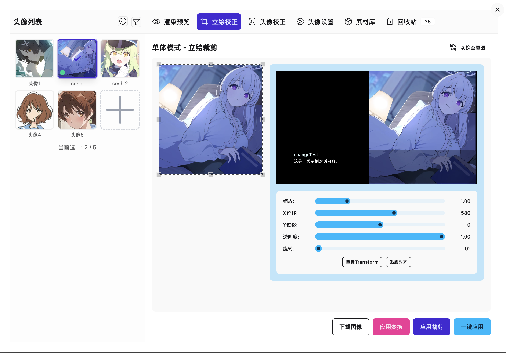
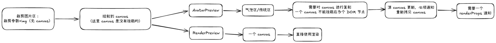
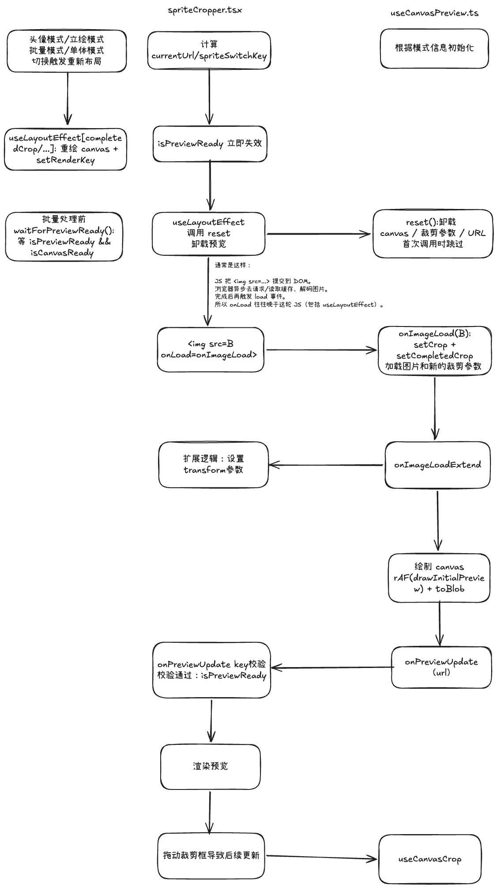

## 业务介绍



## 代码架构






## 立绘预览时序解决

- 裁剪预览业务流程：
	1. 选中角色，读取角色立绘，加载图像
	2. 初始化裁剪框，确定裁剪参数（onCrop 等状态）
	3. 绘制裁剪内部区域至预览画布


这个过程中的问题：
1. 切换问题：瞬间显示旧帧，previewCanvas 还没画新图时，RenderPreview 会先把上一张图露出来；还有旧图片的异步预览回调可能晚到，导致最终显示旧图；还有可选的 transition 应该在绘制前准备好，导致位移闪烁。
2. 模式切换/弹窗切换时，布局先变，canvas 后画；不挡住会出现明显“错位一帧”。
3. 批量操作可能基于未就绪画面，批量前现在会等待 isPreviewReady && isCanvasReady；去掉后更容易拿到旧/空 canvas 做后续处理。

其中 2/3 的问题相对较好解决
- 解决 2 的方式是讲绘制逻辑放在 useLayoutEffect中，在布局稳定后再绘制预览 canvas
- 解决 3 的方式是确保在解决 1 的问题的基础上，再加上 isCanvasReady，确保canvas 和 img 有尺寸

其实主要问题就是围绕角色切换的

角色切换意味着要切换立绘，切换 URL，重新走一遍加载图像，应用裁剪参数，绘制 canvas 的过程，而每个步骤都是需要时间的

整体思路是使用一个 isPreviewReady 的状态，在必要的准备完成时才允许渲染内容

避免快速切换异步时序问题：
- 为绘制 hooks 传入结束的回调，检测旧的异步任务获取的闭包spriteSwitchKey和latestSwitchKeyRef始终代表最新状态的 key 比较即可
```js
    onPreviewUpdate: useCallback(() => {
      // 只接受“最新切换目标”的预览更新，避免快速切换导致旧回调把预览误标记为 ready
      // spriteSwitchKey：定义“当前应该显示的目标”（avatar/source 组合）
      // 读取 DOM 节点，判断是否出现异步错位，只有真实 key 和目标匹配时设置相等了
      if (latestSwitchKeyRef.current === spriteSwitchKey) {
        setPreviewReadyKey(spriteSwitchKey);
      }
    }, [spriteSwitchKey]),
```


避免旧帧出现：
- useLayoutEffect 发现 currentUrl 变了会 resetCropState() 清空 crop/completedCrop/canvas

避免 transition 闪烁：
- 新图片 onload 后再设置裁剪框参数，在绘制前应该提前加载 CSS transition 的参数    onImageLoad 里先 setCrop/setCompletedCrop，还会调用外部 onImageLoadExtend
	- 在这个场景里它会 setDisplayTransform（SpriteCropper）。
	- 如果马上 drawInitialPreview，可能出现“新 canvas 画面 + 旧 transform/旧布局”的一帧错配，用户会看到闪一下。
	- 用 requestAnimationFrame(drawInitialPreview) 把首次绘制放到下一帧，给这些状态提交和CSS transition留出时间

这上方两个措施之间在首次挂载会存在竞态问题：

切换时：
- 先有旧图状态
- currentUrl 变化后 reset 清旧
但是首次挂载时：
- currentUrl 由无到有也会变化
- 导致 onload 设置裁剪参数和 reset 清空裁剪参数都会被触发

就导致了设置的参数被 reset 了，原本这个 reset 是为了让出新的 URL 的，但是首次挂载触发显然是语义错误的

所以解决方式是跳过首次挂载的 useLayoutEffect，利用一个持久存在的 ref值记录是否是首屏状态，利用这个变量在 useLayoutEffect 内部就能提前跳过

现在首屏直接 return（只记录 lastResetSourceUrlRef），不 reset
于是首屏只有 onLoad 在写初始化值，竞态消失。
